# InfoSociety — Swimlane Flow Diagrams (Mermaid)

Paste each code block into [Mermaid Live Editor](https://mermaid.live) or any Mermaid-compatible tool to generate the diagrams.

---

## 1. Society Onboarding

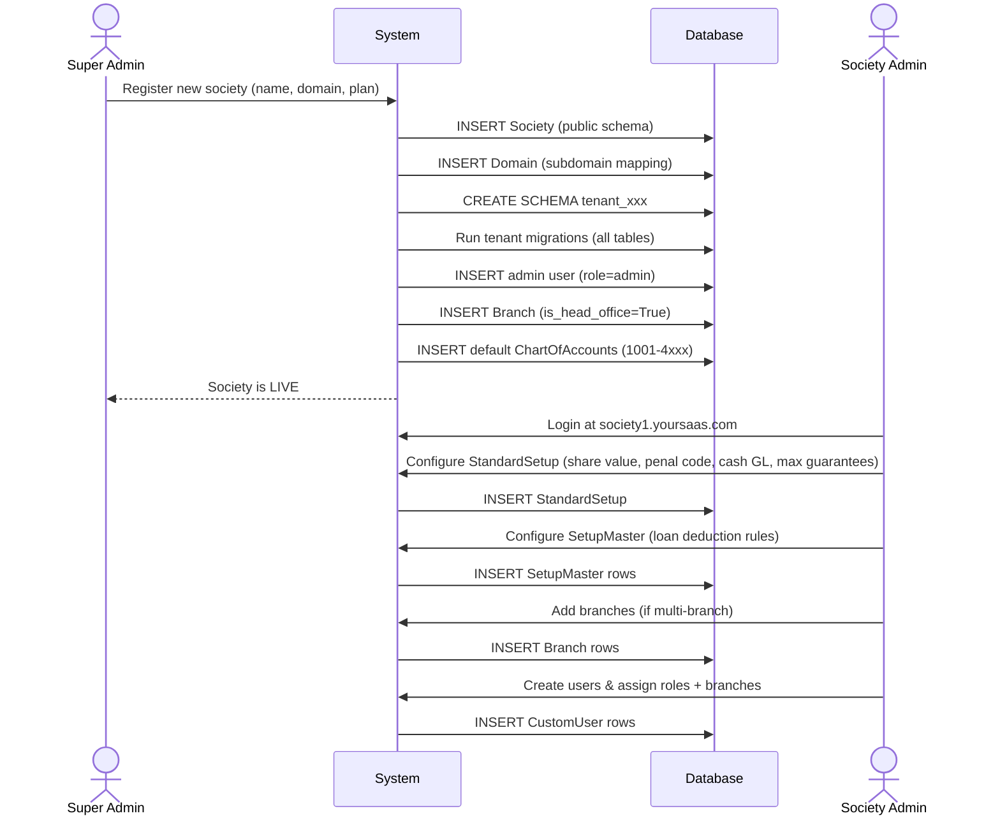
```mermaid
sequenceDiagram
    actor SA as Super Admin
    participant SYS as System
    participant DB as Database
    actor ADM as Society Admin

    SA->>SYS: Register new society (name, domain, plan)
    SYS->>DB: INSERT Society (public schema)
    SYS->>DB: INSERT Domain (subdomain mapping)
    SYS->>DB: CREATE SCHEMA tenant_xxx
    SYS->>DB: Run tenant migrations (all tables)
    SYS->>DB: INSERT admin user (role=admin)
    SYS->>DB: INSERT Branch (is_head_office=True)
    SYS->>DB: INSERT default ChartOfAccounts (1001-4xxx)
    SYS-->>SA: Society is LIVE

    ADM->>SYS: Login at society1.yoursaas.com
    ADM->>SYS: Configure StandardSetup (share value, penal code, cash GL, max guarantees)
    SYS->>DB: INSERT StandardSetup
    ADM->>SYS: Configure SetupMaster (loan deduction rules)
    SYS->>DB: INSERT SetupMaster rows
    ADM->>SYS: Add branches (if multi-branch)
    SYS->>DB: INSERT Branch rows
    ADM->>SYS: Create users & assign roles + branches
    SYS->>DB: INSERT CustomUser rows
```

---

## 2. Member Registration

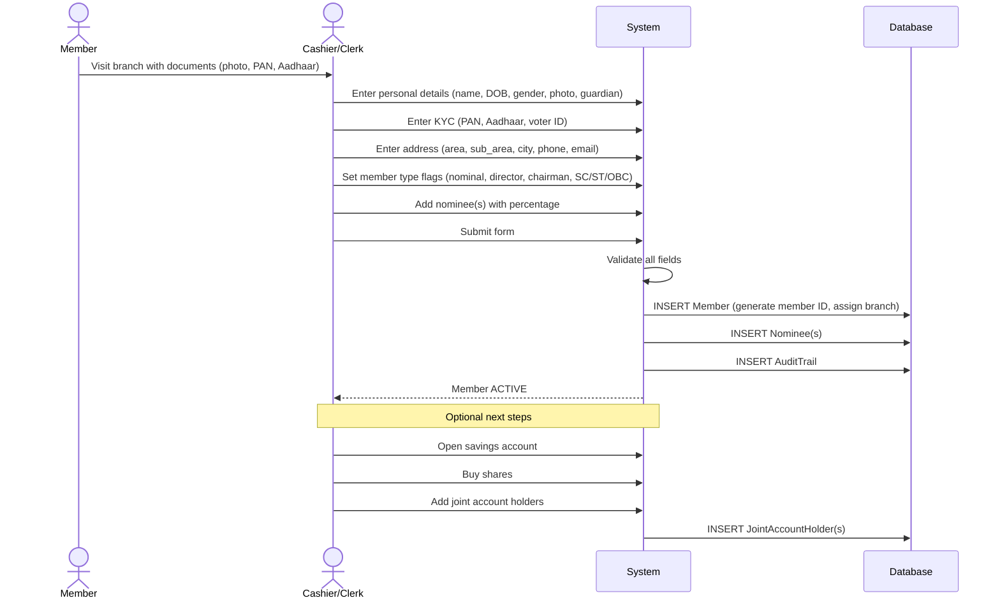
```mermaid
sequenceDiagram
    actor M as Member
    actor C as Cashier/Clerk
    participant SYS as System
    participant DB as Database

    M->>C: Visit branch with documents (photo, PAN, Aadhaar)
    C->>SYS: Enter personal details (name, DOB, gender, photo, guardian)
    C->>SYS: Enter KYC (PAN, Aadhaar, voter ID)
    C->>SYS: Enter address (area, sub_area, city, phone, email)
    C->>SYS: Set member type flags (nominal, director, chairman, SC/ST/OBC)
    C->>SYS: Add nominee(s) with percentage
    C->>SYS: Submit form

    SYS->>SYS: Validate all fields
    SYS->>DB: INSERT Member (generate member ID, assign branch)
    SYS->>DB: INSERT Nominee(s)
    SYS->>DB: INSERT AuditTrail
    SYS-->>C: Member ACTIVE

    Note over C,SYS: Optional next steps
    C->>SYS: Open savings account
    C->>SYS: Buy shares
    C->>SYS: Add joint account holders
    SYS->>DB: INSERT JointAccountHolder(s)
```

---

## 3. Savings Account — Opening

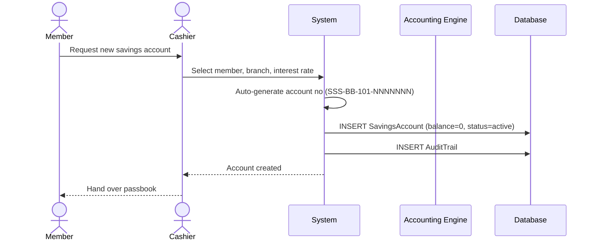
```mermaid
sequenceDiagram
    actor M as Member
    actor C as Cashier
    participant SYS as System
    participant ACC as Accounting Engine
    participant DB as Database

    M->>C: Request new savings account
    C->>SYS: Select member, branch, interest rate
    SYS->>SYS: Auto-generate account no (SSS-BB-101-NNNNNNN)
    SYS->>DB: INSERT SavingsAccount (balance=0, status=active)
    SYS->>DB: INSERT AuditTrail
    SYS-->>C: Account created
    C-->>M: Hand over passbook
```

---

## 4. Savings Deposit

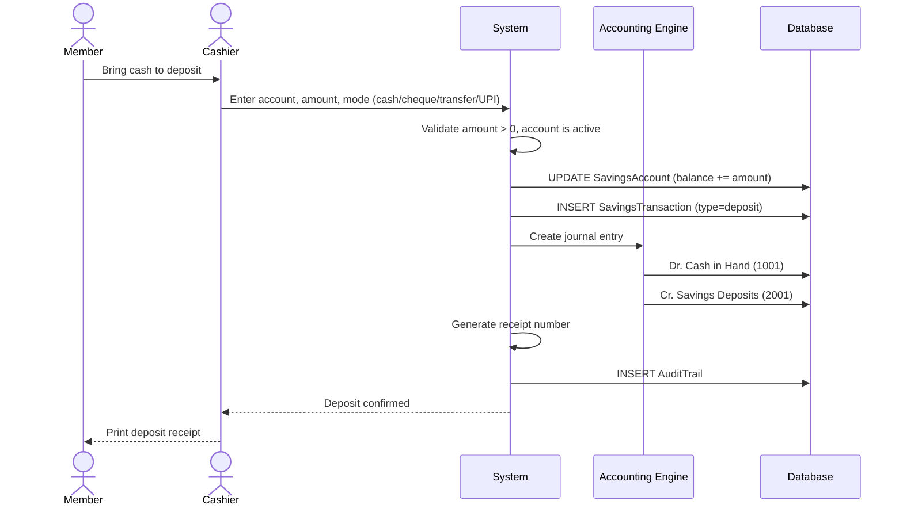
```mermaid
sequenceDiagram
    actor M as Member
    actor C as Cashier
    participant SYS as System
    participant ACC as Accounting Engine
    participant DB as Database

    M->>C: Bring cash to deposit
    C->>SYS: Enter account, amount, mode (cash/cheque/transfer/UPI)
    SYS->>SYS: Validate amount > 0, account is active
    SYS->>DB: UPDATE SavingsAccount (balance += amount)
    SYS->>DB: INSERT SavingsTransaction (type=deposit)
    SYS->>ACC: Create journal entry
    ACC->>DB: Dr. Cash in Hand (1001)
    ACC->>DB: Cr. Savings Deposits (2001)
    SYS->>SYS: Generate receipt number
    SYS->>DB: INSERT AuditTrail
    SYS-->>C: Deposit confirmed
    C-->>M: Print deposit receipt
```

---

## 5. Savings Withdrawal

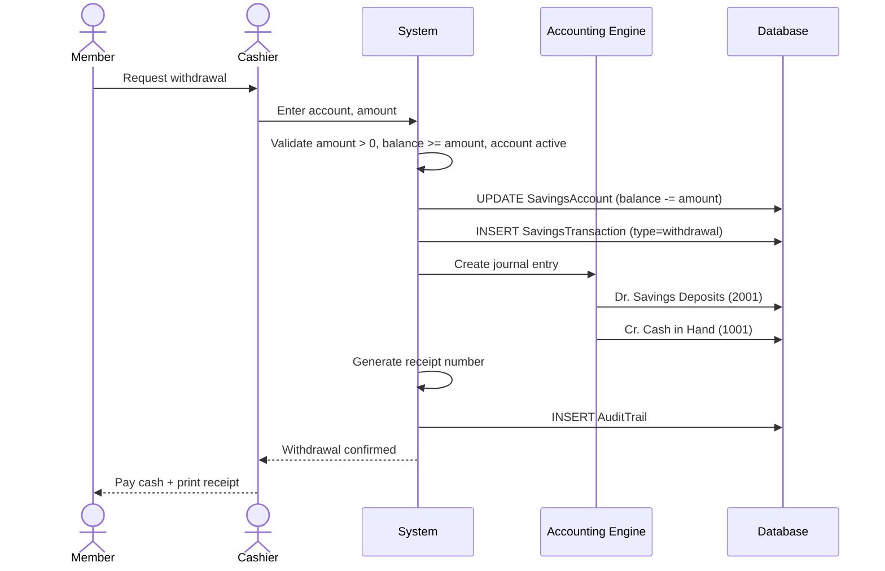
```mermaid
sequenceDiagram
    actor M as Member
    actor C as Cashier
    participant SYS as System
    participant ACC as Accounting Engine
    participant DB as Database

    M->>C: Request withdrawal
    C->>SYS: Enter account, amount
    SYS->>SYS: Validate amount > 0, balance >= amount, account active
    SYS->>DB: UPDATE SavingsAccount (balance -= amount)
    SYS->>DB: INSERT SavingsTransaction (type=withdrawal)
    SYS->>ACC: Create journal entry
    ACC->>DB: Dr. Savings Deposits (2001)
    ACC->>DB: Cr. Cash in Hand (1001)
    SYS->>SYS: Generate receipt number
    SYS->>DB: INSERT AuditTrail
    SYS-->>C: Withdrawal confirmed
    C-->>M: Pay cash + print receipt
```

---

## 6. Share Purchase

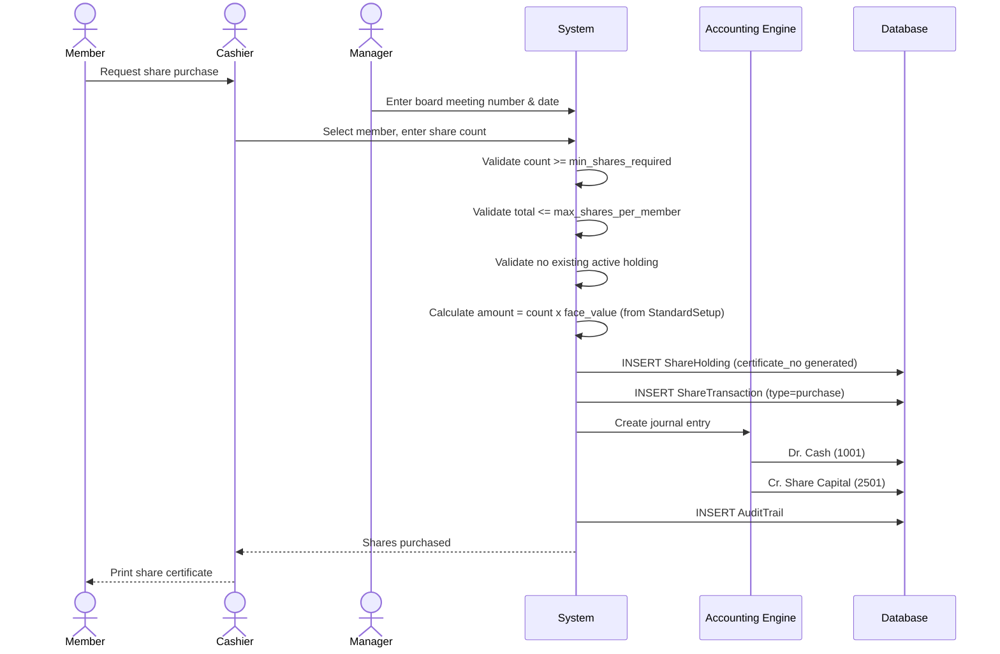
```mermaid
sequenceDiagram
    actor M as Member
    actor C as Cashier
    actor MGR as Manager
    participant SYS as System
    participant ACC as Accounting Engine
    participant DB as Database

    M->>C: Request share purchase
    MGR->>SYS: Enter board meeting number & date
    C->>SYS: Select member, enter share count
    SYS->>SYS: Validate count >= min_shares_required
    SYS->>SYS: Validate total <= max_shares_per_member
    SYS->>SYS: Validate no existing active holding
    SYS->>SYS: Calculate amount = count x face_value (from StandardSetup)
    SYS->>DB: INSERT ShareHolding (certificate_no generated)
    SYS->>DB: INSERT ShareTransaction (type=purchase)
    SYS->>ACC: Create journal entry
    ACC->>DB: Dr. Cash (1001)
    ACC->>DB: Cr. Share Capital (2501)
    SYS->>DB: INSERT AuditTrail
    SYS-->>C: Shares purchased
    C-->>M: Print share certificate
```

---

## 7. Share Transfer

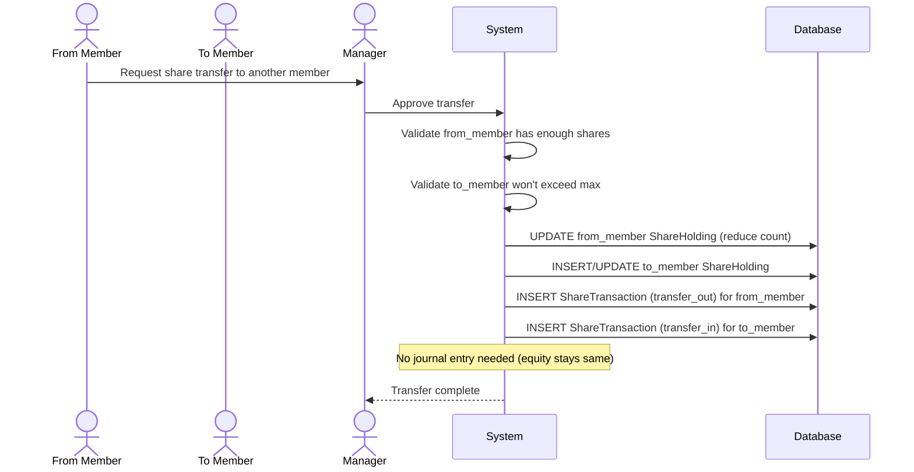
```mermaid
sequenceDiagram
    actor FM as From Member
    actor TM as To Member
    actor MGR as Manager
    participant SYS as System
    participant DB as Database

    FM->>MGR: Request share transfer to another member
    MGR->>SYS: Approve transfer
    SYS->>SYS: Validate from_member has enough shares
    SYS->>SYS: Validate to_member won't exceed max
    SYS->>DB: UPDATE from_member ShareHolding (reduce count)
    SYS->>DB: INSERT/UPDATE to_member ShareHolding
    SYS->>DB: INSERT ShareTransaction (transfer_out) for from_member
    SYS->>DB: INSERT ShareTransaction (transfer_in) for to_member
    Note over SYS: No journal entry needed (equity stays same)
    SYS-->>MGR: Transfer complete
```

---

## 8. Loan Application

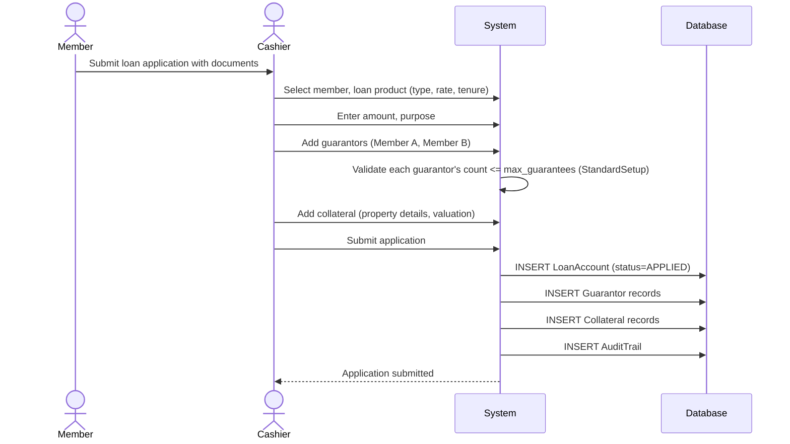
```mermaid
sequenceDiagram
    actor M as Member
    actor C as Cashier
    participant SYS as System
    participant DB as Database

    M->>C: Submit loan application with documents
    C->>SYS: Select member, loan product (type, rate, tenure)
    C->>SYS: Enter amount, purpose
    C->>SYS: Add guarantors (Member A, Member B)
    SYS->>SYS: Validate each guarantor's count <= max_guarantees (StandardSetup)
    C->>SYS: Add collateral (property details, valuation)
    C->>SYS: Submit application
    SYS->>DB: INSERT LoanAccount (status=APPLIED)
    SYS->>DB: INSERT Guarantor records
    SYS->>DB: INSERT Collateral records
    SYS->>DB: INSERT AuditTrail
    SYS-->>C: Application submitted
```

---

## 9. Loan Approval & Disbursement

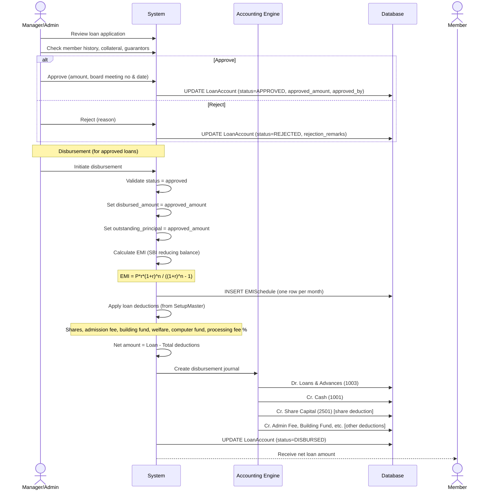
```mermaid
sequenceDiagram
    actor MGR as Manager/Admin
    participant SYS as System
    participant ACC as Accounting Engine
    participant DB as Database
    actor M as Member

    MGR->>SYS: Review loan application
    MGR->>SYS: Check member history, collateral, guarantors

    alt Approve
        MGR->>SYS: Approve (amount, board meeting no & date)
        SYS->>DB: UPDATE LoanAccount (status=APPROVED, approved_amount, approved_by)
    else Reject
        MGR->>SYS: Reject (reason)
        SYS->>DB: UPDATE LoanAccount (status=REJECTED, rejection_remarks)
    end

    Note over MGR,SYS: Disbursement (for approved loans)

    MGR->>SYS: Initiate disbursement
    SYS->>SYS: Validate status = approved
    SYS->>SYS: Set disbursed_amount = approved_amount
    SYS->>SYS: Set outstanding_principal = approved_amount
    SYS->>SYS: Calculate EMI (SBI reducing balance)
    Note over SYS: EMI = P*r*(1+r)^n / ((1+r)^n - 1)
    SYS->>DB: INSERT EMISchedule (one row per month)
    SYS->>SYS: Apply loan deductions (from SetupMaster)
    Note over SYS: Shares, admission fee, building fund, welfare, computer fund, processing fee %
    SYS->>SYS: Net amount = Loan - Total deductions
    SYS->>ACC: Create disbursement journal
    ACC->>DB: Dr. Loans & Advances (1003)
    ACC->>DB: Cr. Cash (1001)
    ACC->>DB: Cr. Share Capital (2501) [share deduction]
    ACC->>DB: Cr. Admin Fee, Building Fund, etc. [other deductions]
    SYS->>DB: UPDATE LoanAccount (status=DISBURSED)
    SYS-->>M: Receive net loan amount
```

---

## 10. EMI Collection

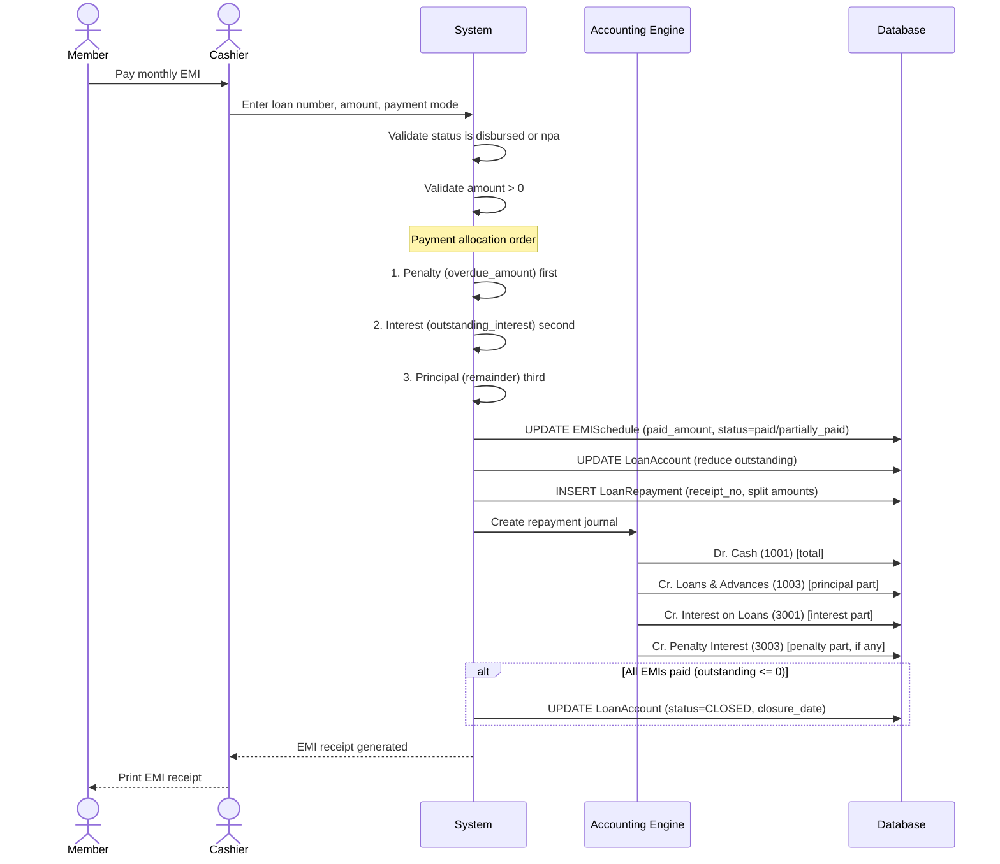
```mermaid
sequenceDiagram
    actor M as Member
    actor C as Cashier
    participant SYS as System
    participant ACC as Accounting Engine
    participant DB as Database

    M->>C: Pay monthly EMI
    C->>SYS: Enter loan number, amount, payment mode
    SYS->>SYS: Validate status is disbursed or npa
    SYS->>SYS: Validate amount > 0

    Note over SYS: Payment allocation order
    SYS->>SYS: 1. Penalty (overdue_amount) first
    SYS->>SYS: 2. Interest (outstanding_interest) second
    SYS->>SYS: 3. Principal (remainder) third

    SYS->>DB: UPDATE EMISchedule (paid_amount, status=paid/partially_paid)
    SYS->>DB: UPDATE LoanAccount (reduce outstanding)
    SYS->>DB: INSERT LoanRepayment (receipt_no, split amounts)

    SYS->>ACC: Create repayment journal
    ACC->>DB: Dr. Cash (1001) [total]
    ACC->>DB: Cr. Loans & Advances (1003) [principal part]
    ACC->>DB: Cr. Interest on Loans (3001) [interest part]
    ACC->>DB: Cr. Penalty Interest (3003) [penalty part, if any]

    alt All EMIs paid (outstanding <= 0)
        SYS->>DB: UPDATE LoanAccount (status=CLOSED, closure_date)
    end

    SYS-->>C: EMI receipt generated
    C-->>M: Print EMI receipt
```

---

## 11. Loan Overdue & NPA (Automated via Day End)

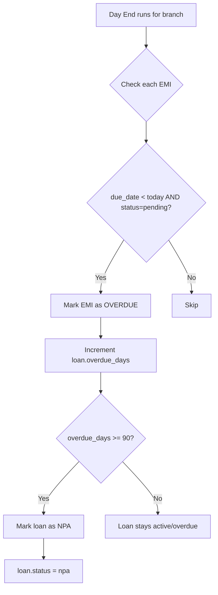
```mermaid
flowchart TD
    A[Day End runs for branch] --> B{Check each EMI}
    B --> C{due_date < today AND status=pending?}
    C -->|Yes| D[Mark EMI as OVERDUE]
    D --> E[Increment loan.overdue_days]
    C -->|No| F[Skip]

    E --> G{overdue_days >= 90?}
    G -->|Yes| H[Mark loan as NPA]
    H --> I[loan.status = npa]
    G -->|No| J[Loan stays active/overdue]
```

---

## 12. Loan Full Lifecycle States

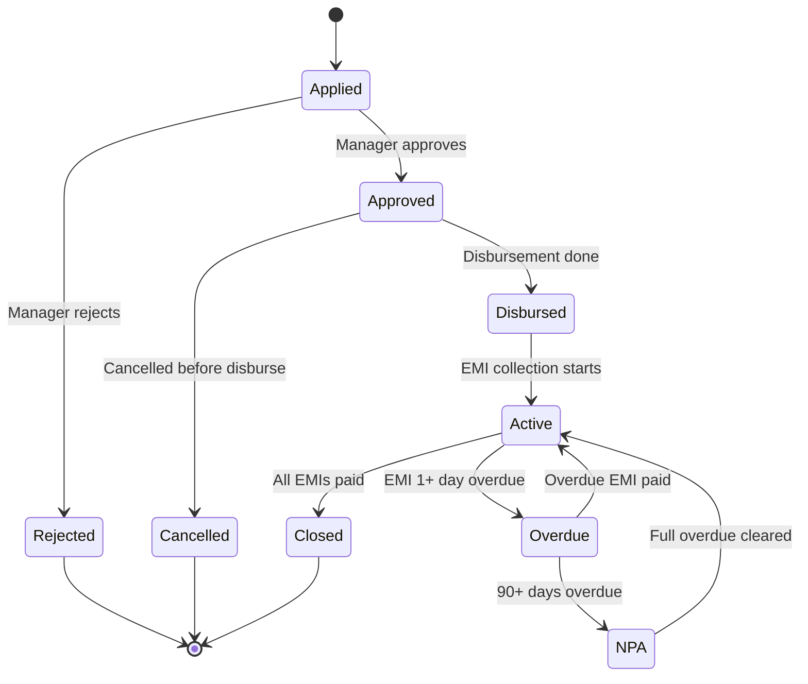
```mermaid
stateDiagram-v2
    [*] --> Applied
    Applied --> Approved: Manager approves
    Applied --> Rejected: Manager rejects
    Approved --> Disbursed: Disbursement done
    Approved --> Cancelled: Cancelled before disburse
    Disbursed --> Active: EMI collection starts
    Active --> Closed: All EMIs paid
    Active --> Overdue: EMI 1+ day overdue
    Overdue --> Active: Overdue EMI paid
    Overdue --> NPA: 90+ days overdue
    NPA --> Active: Full overdue cleared
    Rejected --> [*]
    Cancelled --> [*]
    Closed --> [*]
```

---

## 13. Fixed Deposit — Opening

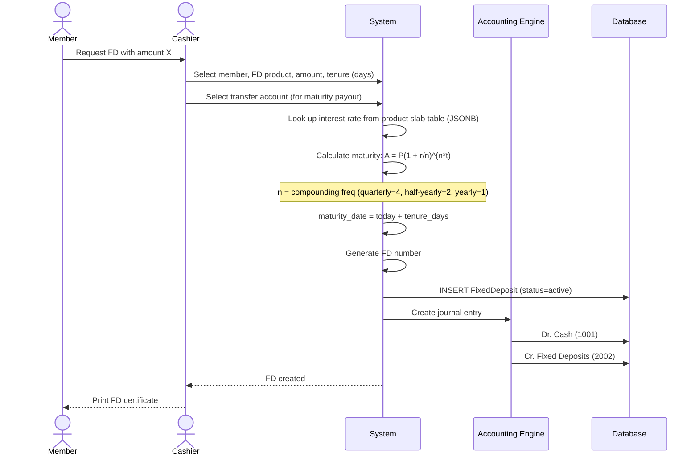
```mermaid
sequenceDiagram
    actor M as Member
    actor C as Cashier
    participant SYS as System
    participant ACC as Accounting Engine
    participant DB as Database

    M->>C: Request FD with amount X
    C->>SYS: Select member, FD product, amount, tenure (days)
    C->>SYS: Select transfer account (for maturity payout)
    SYS->>SYS: Look up interest rate from product slab table (JSONB)
    SYS->>SYS: Calculate maturity: A = P(1 + r/n)^(n*t)
    Note over SYS: n = compounding freq (quarterly=4, half-yearly=2, yearly=1)
    SYS->>SYS: maturity_date = today + tenure_days
    SYS->>SYS: Generate FD number
    SYS->>DB: INSERT FixedDeposit (status=active)
    SYS->>ACC: Create journal entry
    ACC->>DB: Dr. Cash (1001)
    ACC->>DB: Cr. Fixed Deposits (2002)
    SYS-->>C: FD created
    C-->>M: Print FD certificate
```

---

## 14. Fixed Deposit — Maturity / Premature Closure

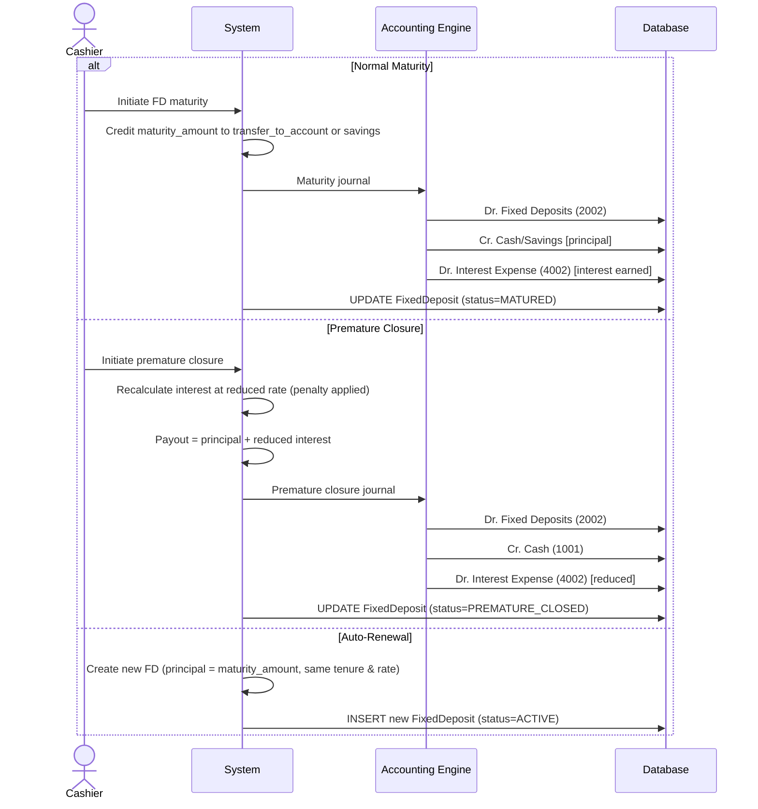
```mermaid
sequenceDiagram
    actor C as Cashier
    participant SYS as System
    participant ACC as Accounting Engine
    participant DB as Database

    alt Normal Maturity
        C->>SYS: Initiate FD maturity
        SYS->>SYS: Credit maturity_amount to transfer_to_account or savings
        SYS->>ACC: Maturity journal
        ACC->>DB: Dr. Fixed Deposits (2002)
        ACC->>DB: Cr. Cash/Savings [principal]
        ACC->>DB: Dr. Interest Expense (4002) [interest earned]
        SYS->>DB: UPDATE FixedDeposit (status=MATURED)

    else Premature Closure
        C->>SYS: Initiate premature closure
        SYS->>SYS: Recalculate interest at reduced rate (penalty applied)
        SYS->>SYS: Payout = principal + reduced interest
        SYS->>ACC: Premature closure journal
        ACC->>DB: Dr. Fixed Deposits (2002)
        ACC->>DB: Cr. Cash (1001)
        ACC->>DB: Dr. Interest Expense (4002) [reduced]
        SYS->>DB: UPDATE FixedDeposit (status=PREMATURE_CLOSED)

    else Auto-Renewal
        SYS->>SYS: Create new FD (principal = maturity_amount, same tenure & rate)
        SYS->>DB: INSERT new FixedDeposit (status=ACTIVE)
    end
```

---

## 15. Recurring Deposit — Full Lifecycle

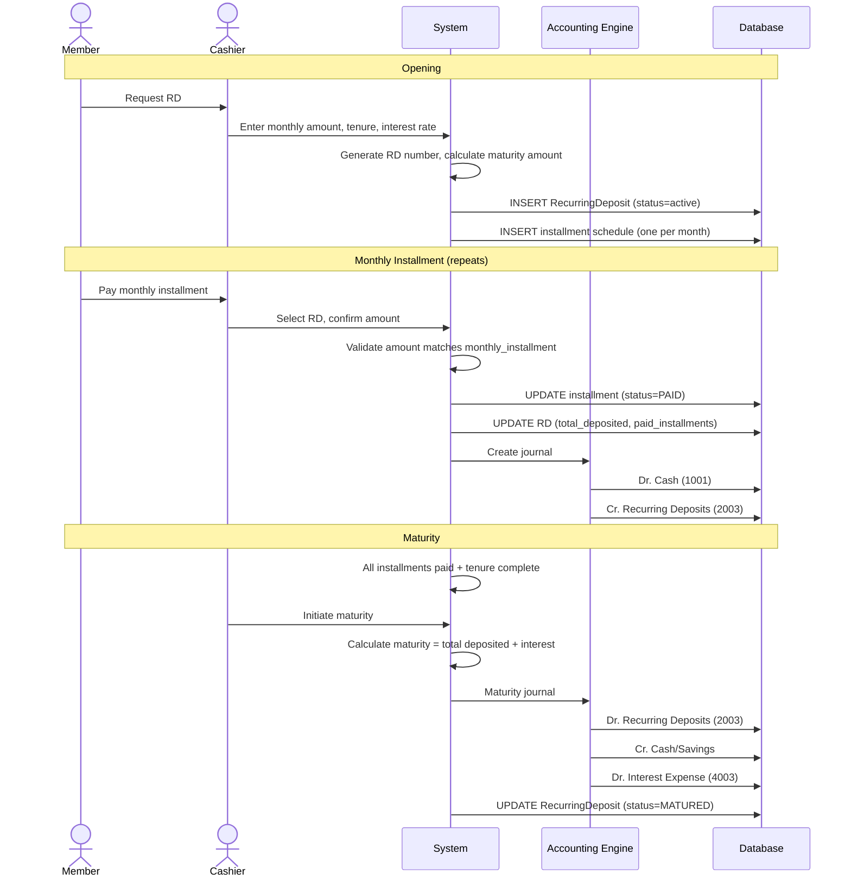
```mermaid
sequenceDiagram
    actor M as Member
    actor C as Cashier
    participant SYS as System
    participant ACC as Accounting Engine
    participant DB as Database

    Note over M,DB: Opening
    M->>C: Request RD
    C->>SYS: Enter monthly amount, tenure, interest rate
    SYS->>SYS: Generate RD number, calculate maturity amount
    SYS->>DB: INSERT RecurringDeposit (status=active)
    SYS->>DB: INSERT installment schedule (one per month)

    Note over M,DB: Monthly Installment (repeats)
    M->>C: Pay monthly installment
    C->>SYS: Select RD, confirm amount
    SYS->>SYS: Validate amount matches monthly_installment
    SYS->>DB: UPDATE installment (status=PAID)
    SYS->>DB: UPDATE RD (total_deposited, paid_installments)
    SYS->>ACC: Create journal
    ACC->>DB: Dr. Cash (1001)
    ACC->>DB: Cr. Recurring Deposits (2003)

    Note over M,DB: Maturity
    SYS->>SYS: All installments paid + tenure complete
    C->>SYS: Initiate maturity
    SYS->>SYS: Calculate maturity = total deposited + interest
    SYS->>ACC: Maturity journal
    ACC->>DB: Dr. Recurring Deposits (2003)
    ACC->>DB: Cr. Cash/Savings
    ACC->>DB: Dr. Interest Expense (4003)
    SYS->>DB: UPDATE RecurringDeposit (status=MATURED)
```

---

## 16. Pigmmy / Agent Daily Collection

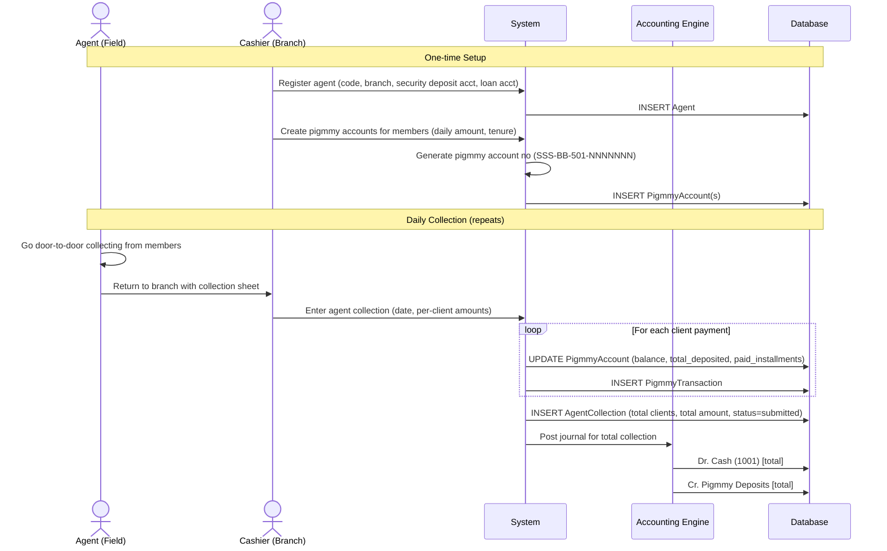
```mermaid
sequenceDiagram
    actor AGT as Agent (Field)
    actor C as Cashier (Branch)
    participant SYS as System
    participant ACC as Accounting Engine
    participant DB as Database

    Note over AGT,DB: One-time Setup
    C->>SYS: Register agent (code, branch, security deposit acct, loan acct)
    SYS->>DB: INSERT Agent
    C->>SYS: Create pigmmy accounts for members (daily amount, tenure)
    SYS->>SYS: Generate pigmmy account no (SSS-BB-501-NNNNNNN)
    SYS->>DB: INSERT PigmmyAccount(s)

    Note over AGT,DB: Daily Collection (repeats)
    AGT->>AGT: Go door-to-door collecting from members
    AGT->>C: Return to branch with collection sheet

    C->>SYS: Enter agent collection (date, per-client amounts)
    loop For each client payment
        SYS->>DB: UPDATE PigmmyAccount (balance, total_deposited, paid_installments)
        SYS->>DB: INSERT PigmmyTransaction
    end
    SYS->>DB: INSERT AgentCollection (total clients, total amount, status=submitted)
    SYS->>ACC: Post journal for total collection
    ACC->>DB: Dr. Cash (1001) [total]
    ACC->>DB: Cr. Pigmmy Deposits [total]
```

---

## 17. Receipt Transaction

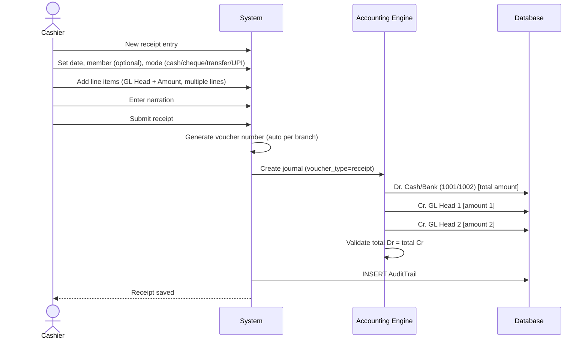
```mermaid
sequenceDiagram
    actor C as Cashier
    participant SYS as System
    participant ACC as Accounting Engine
    participant DB as Database

    C->>SYS: New receipt entry
    C->>SYS: Set date, member (optional), mode (cash/cheque/transfer/UPI)
    C->>SYS: Add line items (GL Head + Amount, multiple lines)
    C->>SYS: Enter narration
    C->>SYS: Submit receipt

    SYS->>SYS: Generate voucher number (auto per branch)
    SYS->>ACC: Create journal (voucher_type=receipt)
    ACC->>DB: Dr. Cash/Bank (1001/1002) [total amount]
    ACC->>DB: Cr. GL Head 1 [amount 1]
    ACC->>DB: Cr. GL Head 2 [amount 2]
    ACC->>ACC: Validate total Dr = total Cr
    SYS->>DB: INSERT AuditTrail
    SYS-->>C: Receipt saved
```

---

## 18. Payment Transaction

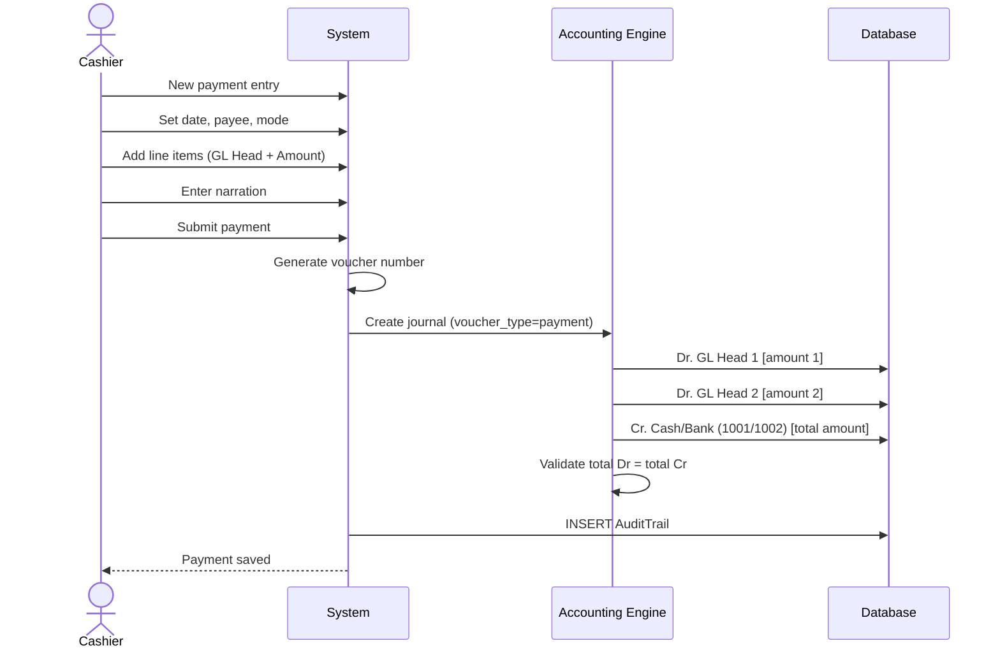
```mermaid
sequenceDiagram
    actor C as Cashier
    participant SYS as System
    participant ACC as Accounting Engine
    participant DB as Database

    C->>SYS: New payment entry
    C->>SYS: Set date, payee, mode
    C->>SYS: Add line items (GL Head + Amount)
    C->>SYS: Enter narration
    C->>SYS: Submit payment

    SYS->>SYS: Generate voucher number
    SYS->>ACC: Create journal (voucher_type=payment)
    ACC->>DB: Dr. GL Head 1 [amount 1]
    ACC->>DB: Dr. GL Head 2 [amount 2]
    ACC->>DB: Cr. Cash/Bank (1001/1002) [total amount]
    ACC->>ACC: Validate total Dr = total Cr
    SYS->>DB: INSERT AuditTrail
    SYS-->>C: Payment saved
```

---

## 19. Day End Processing

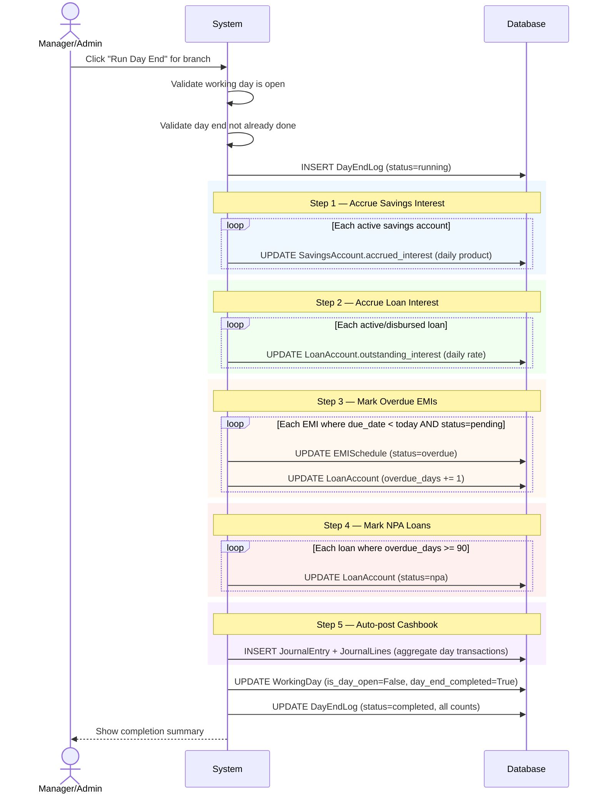
```mermaid
sequenceDiagram
    actor MGR as Manager/Admin
    participant SYS as System
    participant DB as Database

    MGR->>SYS: Click "Run Day End" for branch
    SYS->>SYS: Validate working day is open
    SYS->>SYS: Validate day end not already done
    SYS->>DB: INSERT DayEndLog (status=running)

    rect rgb(240, 248, 255)
        Note over SYS,DB: Step 1 — Accrue Savings Interest
        loop Each active savings account
            SYS->>DB: UPDATE SavingsAccount.accrued_interest (daily product)
        end
    end

    rect rgb(240, 255, 240)
        Note over SYS,DB: Step 2 — Accrue Loan Interest
        loop Each active/disbursed loan
            SYS->>DB: UPDATE LoanAccount.outstanding_interest (daily rate)
        end
    end

    rect rgb(255, 248, 240)
        Note over SYS,DB: Step 3 — Mark Overdue EMIs
        loop Each EMI where due_date < today AND status=pending
            SYS->>DB: UPDATE EMISchedule (status=overdue)
            SYS->>DB: UPDATE LoanAccount (overdue_days += 1)
        end
    end

    rect rgb(255, 240, 240)
        Note over SYS,DB: Step 4 — Mark NPA Loans
        loop Each loan where overdue_days >= 90
            SYS->>DB: UPDATE LoanAccount (status=npa)
        end
    end

    rect rgb(248, 240, 255)
        Note over SYS,DB: Step 5 — Auto-post Cashbook
        SYS->>DB: INSERT JournalEntry + JournalLines (aggregate day transactions)
    end

    SYS->>DB: UPDATE WorkingDay (is_day_open=False, day_end_completed=True)
    SYS->>DB: UPDATE DayEndLog (status=completed, all counts)
    SYS-->>MGR: Show completion summary
```

---

## 20. Day End — Rollback

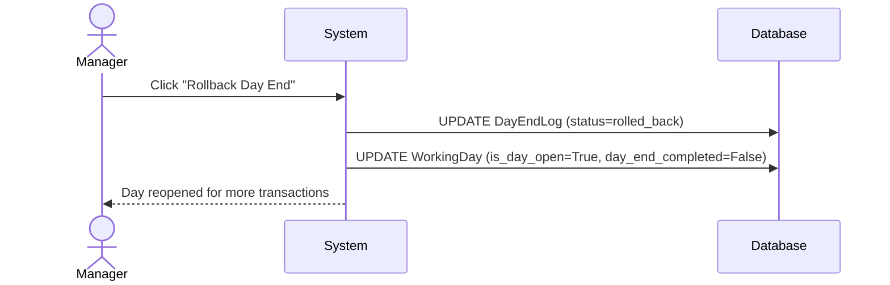
```mermaid
sequenceDiagram
    actor MGR as Manager
    participant SYS as System
    participant DB as Database

    MGR->>SYS: Click "Rollback Day End"
    SYS->>DB: UPDATE DayEndLog (status=rolled_back)
    SYS->>DB: UPDATE WorkingDay (is_day_open=True, day_end_completed=False)
    SYS-->>MGR: Day reopened for more transactions
```

---

## 21. Month End Processing

```mermaid
sequenceDiagram
    actor MGR as Manager/Admin
    participant SYS as System
    participant ACC as Accounting Engine
    participant DB as Database

    MGR->>SYS: Run Month End for branch + month
    SYS->>SYS: Validate all days in month are closed
    SYS->>DB: INSERT MonthEndLog (status=running)

    rect rgb(240, 248, 255)
        Note over SYS,DB: Step 1 — Post Savings Interest
        loop Each active savings account
            SYS->>DB: UPDATE SavingsAccount (balance += accrued_interest, reset accrued=0)
            SYS->>ACC: Journal entry
            ACC->>DB: Dr. Interest on Savings (4001)
            ACC->>DB: Cr. Savings Deposits (2001)
        end
    end

    rect rgb(240, 255, 240)
        Note over SYS,DB: Step 2 — Loan Interest Demand
        loop Each active loan
            SYS->>DB: UPDATE LoanAccount (calculate monthly interest, add to outstanding)
        end
    end

    rect rgb(255, 248, 240)
        Note over SYS,DB: Step 3 — Default RD Check
        loop Each RD with unpaid installment for this month
            SYS->>DB: UPDATE RD installment (status=defaulted)
        end
    end

    SYS->>DB: UPDATE MonthEndLog (status=completed)
    SYS-->>MGR: Show month-end summary
```

---

## 22. Year End Processing

```mermaid
sequenceDiagram
    actor ADM as Society Admin
    participant SYS as System
    participant ACC as Accounting Engine
    participant DB as Database

    ADM->>SYS: Run Year End for financial year
    SYS->>SYS: Validate year end not already done
    SYS->>DB: INSERT YearEndLog (status=running)

    rect rgb(240, 248, 255)
        Note over SYS,DB: Step 1 & 2 — Calculate P&L
        SYS->>DB: SUM all income heads (3xxx): credits - debits = total_income
        SYS->>DB: SUM all expense heads (4xxx): debits - credits = total_expense
        SYS->>SYS: profit_or_loss = total_income - total_expense
    end

    rect rgb(255, 248, 240)
        Note over SYS,DB: Step 3 — Zero Out P&L Accounts
        loop Each income & expense account
            SYS->>DB: UPDATE ChartOfAccounts (current_balance = 0)
        end
    end

    rect rgb(240, 255, 240)
        Note over SYS,DB: Step 4 — Transfer to Reserves
        alt Profit > 0
            SYS->>ACC: Journal: Dr. Income Summary → Cr. Reserves (Equity)
        else Loss > 0
            SYS->>ACC: Journal: Dr. Reserves (Equity) → Cr. Expense Summary
        end
        ACC->>DB: INSERT JournalEntry + JournalLines
    end

    rect rgb(248, 240, 255)
        Note over SYS,DB: Step 5 — Carry Forward Opening Balances
        loop Each asset/liability/equity account
            SYS->>DB: UPDATE ChartOfAccounts (carry forward current_balance as new year OB)
        end
    end

    SYS->>DB: UPDATE FinancialYear (is_closed=True)
    SYS->>DB: UPDATE YearEndLog (status=completed, profit_or_loss, counts)
    SYS-->>ADM: Show P&L summary (Net Profit/Loss, accounts zeroed, balances carried)
```

---

## 23. Complete Daily Operations Timeline

```mermaid
gantt
    title Daily Branch Operations Timeline
    dateFormat HH:mm
    axisFormat %H:%M

    section Manager
    Begin Working Day           :mgr1, 08:00, 15min
    Review Loan Applications    :mgr2, 12:00, 60min
    Disburse Approved Loans     :mgr3, 13:00, 30min
    Run Day End                 :mgr4, 17:00, 30min

    section Cashier
    Savings Deposits            :cash1, 09:00, 60min
    EMI Collections             :cash2, 10:00, 60min
    FD/RD Operations            :cash3, 11:00, 60min
    Receipt/Payment Vouchers    :cash4, 14:00, 60min
    Agent Collection Entry      :cash5, 15:00, 60min

    section System (Auto)
    Open Working Day            :sys1, 08:00, 5min
    Journal Entries (all day)   :sys2, 09:00, 480min
    Day End Batch Processing    :sys3, 17:00, 30min
```

---

## 24. Complete System Lifecycle — End to End

```mermaid
flowchart TB
    subgraph SETUP["Phase 1: Setup"]
        S1[Create Tenant & Schema] --> S2[Initialize GL Heads]
        S2 --> S3[Configure StandardSetup]
        S3 --> S4[Configure SetupMaster]
        S4 --> S5[Add Branches & Users]
    end

    subgraph ENROLLMENT["Phase 2: Enrollment"]
        E1[Register Member] --> E2[Add KYC & Nominees]
        E2 --> E3[Buy Shares - mandatory]
        E3 --> E4[Open Savings Account]
        E4 --> E5[Add Joint Account Holders]
    end

    subgraph DAILY["Phase 3: Daily Operations"]
        D0[Begin Working Day] --> D1[Deposits & Withdrawals]
        D1 --> D2[EMI Collections]
        D2 --> D3[FD/RD Operations]
        D3 --> D4[Receipt/Payment Vouchers]
        D4 --> D5[Agent Pigmmy Collections]
        D5 --> D6[Run Day End]
    end

    subgraph LOANS["Phase 4: Loan Cycle"]
        L1[Loan Application] --> L2[Manager Review]
        L2 --> L3{Approve?}
        L3 -->|Yes| L4[Disburse with Deductions]
        L3 -->|No| L5[Rejected]
        L4 --> L6[Monthly EMI Collection]
        L6 --> L7{All EMIs Paid?}
        L7 -->|Yes| L8[Loan Closed]
        L7 -->|No| L9{Overdue > 90 days?}
        L9 -->|Yes| L10[Mark NPA]
        L9 -->|No| L6
    end

    subgraph PERIOD["Phase 5: Period End"]
        P1[Day End - daily] --> P2[Month End - monthly]
        P2 --> P3[Year End - annually]
        P3 --> P4[P&L Transfer to Reserves]
        P4 --> P5[Carry Forward Balances]
    end

    subgraph REPORTS["Phase 6: Reports"]
        R1[Trial Balance]
        R2[Profit & Loss]
        R3[Balance Sheet]
        R4[Loan/Deposit/Member Reports]
        R5[Cash Book / Day Book]
    end

    SETUP --> ENROLLMENT
    ENROLLMENT --> DAILY
    DAILY --> LOANS
    DAILY --> PERIOD
    PERIOD --> REPORTS
```

---

## 25. Accounting Double-Entry Flow

```mermaid
flowchart LR
    subgraph TRANSACTIONS["Transactions"]
        T1[Savings Deposit]
        T2[Savings Withdrawal]
        T3[Loan Disbursement]
        T4[EMI Collection]
        T5[FD Creation]
        T6[FD Maturity]
        T7[RD Installment]
        T8[Share Purchase]
        T9[Receipt Voucher]
        T10[Payment Voucher]
    end

    subgraph JOURNAL["Journal Entry"]
        JE[JournalEntry<br/>date, voucher_type,<br/>voucher_no, narration]
    end

    subgraph LINES["Journal Lines - Always Balanced"]
        DR[Debit Lines<br/>Total Dr]
        CR[Credit Lines<br/>Total Cr]
    end

    subgraph GL["Chart of Accounts"]
        A["Assets (1xxx)<br/>Cash, Bank, Loans"]
        L["Liabilities (2xxx)<br/>Savings, FD, RD"]
        E["Equity (25xx)<br/>Share Capital"]
        I["Income (3xxx)<br/>Interest, Fees"]
        X["Expenses (4xxx)<br/>Interest Paid"]
    end

    T1 & T2 & T3 & T4 & T5 & T6 & T7 & T8 & T9 & T10 --> JE
    JE --> DR & CR
    DR --> A & L & E & I & X
    CR --> A & L & E & I & X

    style DR fill:#fee,stroke:#c00
    style CR fill:#efe,stroke:#0a0
```
